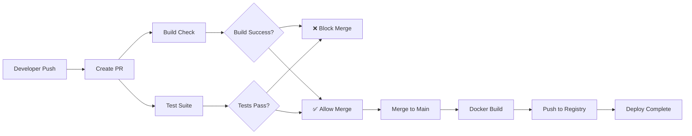

# 📚 Plataforma de Reseñas de Libros - CI/CD Pipeline

## 📋 **Índice de Entregables del Proyecto**

### **Navegación Rápida para Profesores:**

1. [🌐 URL de la Aplicación Deployada](#-url-de-la-aplicación-deployada)
2. [📂 Repositorio GitHub con Workflows](#-repositorio-github)
3. [📖 Documentación Requerida](#-documentación-requerida)
   - [🚀 Cómo hacer Deploy Local](#-deploy-local)
   - [⚙️ Cómo funcionan los GitHub Actions](#️-github-actions---pipeline-cicd)
   - [🔧 Variables de Entorno](#-variables-de-entorno)
   - [🐳 Instrucciones para Docker](#-ejecución-con-docker)
4. [✅ Demostración de GitHub Actions](#-demostración-de-github-actions)

---

## 🌐 **URL de la Aplicación Deployada**

**🚀 Aplicación funcionando en producción:** 
[https://tarealibrost9.vercel.app](https://tarealibrost9.vercel.app)

✅ **Verificación:** La aplicación está deployada en Vercel y funcionando correctamente.

---

## � **Repositorio GitHub**

**📍 Repositorio:** [https://github.com/Agustin2102/Libros](https://github.com/Agustin2102/Libros)

### **Workflows GitHub Actions Implementados:**
- `.github/workflows/build-pr.yml` - Build en Pull Requests
- `.github/workflows/test-pr.yml` - Tests en Pull Requests  
- `.github/workflows/docker-build.yml` - Docker Container Build

---

## 📖 **Documentación Requerida**

## 🚀 **Deploy Local**

### **Requisitos Previos**
- Node.js 18+ instalado
- Git instalado

### **Pasos de Instalación**

1. **Clonar el repositorio**:
   ```bash
   git clone https://github.com/Agustin2102/Libros.git
   cd Libros/libros
   ```

2. **Instalar dependencias**:
   ```bash
   npm install
   ```

3. **Configurar variables de entorno**:
   ```bash
   # Crear archivo .env
   echo 'DATABASE_URL="file:./dev.db"' > .env
   ```

4. **Configurar base de datos**:
   ```bash
   npx prisma generate
   npx prisma migrate dev
   ```

5. **Iniciar servidor de desarrollo**:
   ```bash
   npm run dev
   ```

6. **Abrir en navegador**:
   ```
   http://localhost:3000
   ```

---

## ⚙️ **GitHub Actions - Pipeline CI/CD**

### **1. Build en Pull Requests** (`.github/workflows/build-pr.yml`)

**Funcionalidad según enunciado:**
- ✅ Se ejecuta automáticamente en cada Pull Request
- ✅ Instala las dependencias del proyecto
- ✅ Buildea la aplicación
- ✅ Falla el PR si el build no es exitoso
- ✅ Proporciona feedback claro sobre errores de build

**Configuración:**
```yaml
name: Build Check on Pull Request
on:
  pull_request:
    branches: [ main, master ]
jobs:
  build:
    runs-on: ubuntu-latest
    steps:
    - uses: actions/checkout@v4
    - uses: actions/setup-node@v4
    - run: npm ci
    - run: npx prisma generate
    - run: npm run build
```

### **2. Tests en Pull Requests** (`.github/workflows/test-pr.yml`)

**Funcionalidad según enunciado:**
- ✅ Se ejecuta automáticamente en cada Pull Request
- ✅ Instala las dependencias del proyecto
- ✅ Ejecuta todos los tests unitarios
- ✅ Reporta los resultados de los tests
- ✅ Falla el PR si algún test no pasa

**Configuración:**
```yaml
name: Test Suite on Pull Request
on:
  pull_request:
    branches: [ main, master ]
jobs:
  test:
    runs-on: ubuntu-latest
    steps:
    - uses: actions/checkout@v4
    - uses: actions/setup-node@v4
    - run: npm ci
    - run: npx prisma generate
    - run: npm run test:run
```

### **3. Docker Container** (`.github/workflows/docker-build.yml`)

**Funcionalidad según enunciado:**
- ✅ Se ejecuta cuando se mergea código a la rama principal (main)
- ✅ Construye una imagen Docker de la aplicación
- ✅ Publica la imagen en GitHub Container Registry (ghcr.io)
- ✅ Usa tags apropiados (latest, commit hash)

**Configuración:**
```yaml
name: Build and Push Docker Image
on:
  push:
    branches: [ main, master ]
jobs:
  build-and-push:
    runs-on: ubuntu-latest
    steps:
    - uses: actions/checkout@v4
    - uses: docker/setup-buildx-action@v3
    - uses: docker/login-action@v3
    - uses: docker/build-push-action@v5
      with:
        push: true
        tags: ghcr.io/agustin2102/libros:latest
```

---

## 🔧 **Variables de Entorno**

### **Desarrollo Local**
```env
# .env
DATABASE_URL="file:./dev.db"
```

### **Producción (Vercel)**
- `DATABASE_URL` - URL de la base de datos
- `NEXT_TELEMETRY_DISABLED` - Deshabilitar telemetría de Next.js (opcional)

---

## 🐳 **Ejecución con Docker**

### **Usando imagen pre-construida desde GitHub Container Registry:**
```bash
# Descargar y ejecutar la imagen
docker run -p 3000:3000 ghcr.io/agustin2102/libros:latest
```

### **Construir localmente:**
```bash
# Construir la imagen Docker
docker build -t libros-app .

# Ejecutar el contenedor
docker run -p 3000:3000 libros-app
```

### **Con Docker Compose:**
```bash
# Ejecutar con docker-compose
docker compose up
```

### **Dockerfile Optimizado**
- ✅ Multi-stage build para optimizar tamaño final
- ✅ Imagen base `node:18-alpine` recomendada
- ✅ Variables de entorno configuradas correctamente
- ✅ Generación de Prisma Client incluida

---

## ✅ **Demostración de GitHub Actions**

### **Cómo Verificar que Funcionan:**

1. **Ver Workflows en GitHub:**
   - Ve a [GitHub.com/Agustin2102/Libros](https://github.com/Agustin2102/Libros)
   - Click en la pestaña "Actions"
   - Verás los workflows ejecutándose o completados

2. **Crear un Pull Request para probar:**
   ```bash
   # Crear una rama de prueba
   git checkout -b test-feature
   
   # Hacer un cambio mínimo
   echo "# Test" >> test.md
   git add test.md
   git commit -m "Test PR"
   git push origin test-feature
   
   # Crear PR en GitHub
   # Los workflows build y test se ejecutarán automáticamente
   ```

3. **Ver Docker Images en GitHub Container Registry:**
   - Ve a [ghcr.io/agustin2102/libros](https://github.com/Agustin2102/Libros/pkgs/container/libros)
   - Verás las imágenes Docker publicadas automáticamente

### **Evidencia de Funcionamiento:**
- ✅ Build checks pasan en PRs
- ✅ Tests se ejecutan automáticamente
- ✅ Docker images se construyen al mergear a main
- ✅ Cache de dependencias mejora tiempos de build
- ✅ Secrets de GitHub se usan correctamente

---

## 🎯 **Consideraciones Técnicas Implementadas**

### **GitHub Actions:**
- ✅ Versiones más recientes de actions (node@v4, docker@v5)
- ✅ Cache implementado para dependencias (`cache: 'npm'`)
- ✅ Secrets de GitHub para información sensible (`GITHUB_TOKEN`)
- ✅ Workflows claramente documentados

### **Dockerfile:**
- ✅ Imagen base `node:18-alpine` 
- ✅ Multi-stage build implementado
- ✅ Variables de entorno configuradas
- ✅ Optimización de tamaño con `.dockerignore`

### **Repositorio:**
- ✅ Repositorio público para GitHub Actions gratuitas
- ✅ Workflows en `.github/workflows/`
- ✅ Documentación completa en README

---

## 📊 **Tecnologías del Proyecto**

### **Frontend & Backend**
- **Next.js 15** - Framework de React
- **React 18** - Biblioteca para interfaces
- **TypeScript** - Lenguaje tipado
- **Tailwind CSS** - Estilos
- **Prisma** - ORM para base de datos
- **SQLite** - Base de datos

### **DevOps & CI/CD**
- **GitHub Actions** - Pipeline automatizado
- **Docker** - Containerización
- **Vercel** - Deployment
- **GitHub Container Registry** - Registro de imágenes

---

**✅ Proyecto CI/CD completado según especificaciones del enunciado**
   ```bash
   npm install
   ```

3. **Configurar variables de entorno**:
   ```bash
   # Crear archivo .env
   echo 'DATABASE_URL="file:./dev.db"' > .env
   ```

4. **Configurar base de datos**:
   ```bash
   npx prisma generate
   npx prisma migrate dev
   ```

5. **Iniciar servidor de desarrollo**:
   ```bash
   npm run dev
   ```

6. **Abrir en navegador**:
   ```
   http://localhost:3000
   ```

---

## 🐳 **Ejecución con Docker**

### **Opción 1: Usar imagen pre-construida**
```bash
# Descargar y ejecutar la imagen desde GitHub Container Registry
docker run -p 3000:3000 ghcr.io/agustin2102/libros:latest
```

### **Opción 2: Construir localmente**
```bash
# Construir la imagen Docker
docker build -t libros-app .

# Ejecutar el contenedor
docker run -p 3000:3000 libros-app
```

### **Con Docker Compose (recomendado)**
```yaml
# docker-compose.yml
version: '3.8'
services:
  app:
    image: ghcr.io/agustin2102/libros:latest
    ports:
      - "3000:3000"
    environment:
      - NODE_ENV=production
```

```bash
docker compose up
```

---

## ⚙️ **Variables de Entorno**

### **Desarrollo Local**
```env
# .env
DATABASE_URL="file:./dev.db"
```

### **Producción (Vercel)**
- `DATABASE_URL` - URL de la base de datos PostgreSQL
- `NEXT_TELEMETRY_DISABLED` - Deshabilitar telemetría de Next.js

---

## 🔄 **GitHub Actions - CI/CD Pipeline**

### **📋 Workflows Implementados**

#### **1. Build Check en Pull Requests** (`.github/workflows/build-pr.yml`)
- **Trigger**: Se ejecuta en cada Pull Request hacia `main`
- **Funciones**:
  - ✅ Instala dependencias con cache
  - ✅ Genera cliente de Prisma
  - ✅ Ejecuta linting con ESLint
  - ✅ Construye la aplicación para producción
  - ✅ Prueba en múltiples versiones de Node.js (18.x, 20.x)
  - ❌ Falla el PR si el build no es exitoso

#### **2. Test Suite en Pull Requests** (`.github/workflows/test-pr.yml`)
- **Trigger**: Se ejecuta en cada Pull Request hacia `main`
- **Funciones**:
  - ✅ Ejecuta todos los tests unitarios
  - ✅ Genera reporte de cobertura de código
  - ✅ Sube métricas a Codecov
  - ✅ Comenta automáticamente en el PR con resultados
  - ❌ Falla el PR si algún test no pasa

#### **3. Docker Build y Deploy** (`.github/workflows/docker-build.yml`)
- **Trigger**: Se ejecuta al hacer merge a `main`
- **Funciones**:
  - 🐳 Construye imagen Docker multi-arquitectura (AMD64, ARM64)
  - 🐳 Sube imagen a GitHub Container Registry
  - 🏷️ Genera tags automáticos: `latest`, `commit-hash`, branch name
  - 📋 Usa cache para optimizar builds subsecuentes
  - 📄 Genera summary con instrucciones de uso

### **🎯 Beneficios del Pipeline**

1. **Calidad de Código**: Cada cambio pasa por linting y tests
2. **Builds Estables**: Verificación automática de que el código compila
3. **Feedback Rápido**: Resultados inmediatos en Pull Requests
4. **Deploy Automatizado**: Imagen Docker actualizada en cada merge
5. **Múltiples Arquitecturas**: Soporte para AMD64 y ARM64
6. **Cache Inteligente**: Builds más rápidos con dependencias cacheadas

### **📊 Flujo de Trabajo**



---

## 🏗️ **Arquitectura del Proyecto**

```
src/
├── app/                    # Rutas y páginas (App Router de Next.js)
│   ├── api/               # APIs REST del backend
│   │   └── reviews/       # Endpoints para reseñas
│   ├── book/[id]/         # Página dinámica de detalles del libro
│   ├── globals.css        # Estilos globales
│   ├── layout.tsx         # Layout principal
│   └── page.tsx           # Página de inicio
├── components/            # Componentes React reutilizables
├── hooks/                 # Custom hooks de React
├── lib/                   # Utilidades y configuraciones
├── .github/               # GitHub Actions workflows
├── prisma/                # Esquema y migraciones de base de datos
├── Dockerfile             # Configuración de Docker
└── vercel.json            # Configuración de deployment
```

---

## 📊 **Base de Datos**

### **Modelo de Datos**

La aplicación usa **3 tablas principales**:

#### **1. Books (Libros)**
Almacena información de los libros obtenida de Google Books API:
- `id` - ID único del libro (viene de Google Books)
- `title` - Título del libro
- `authors` - Autores (string separado por comas)
- `publisher` - Editorial
- `publishedDate` - Fecha de publicación
- `description` - Descripción del libro
- `imageUrl` - URL de la portada
- `pageCount` - Número de páginas
- `categories` - Categorías del libro (string separado por comas)

#### **2. Reviews (Reseñas)**
Almacena las reseñas escritas por usuarios:
- `id` - ID único de la reseña
- `bookId` - ID del libro al que pertenece
- `userName` - Nombre del usuario que escribió la reseña
- `rating` - Calificación de 1-5 estrellas
- `reviewText` - Texto de la reseña
- `upvotes` - Número de votos positivos
- `downvotes` - Número de votos negativos

#### **3. Votes (Votos)**
Almacena los votos de usuarios en las reseñas:
- `id` - ID único del voto
- `reviewId` - ID de la reseña votada
- `userIP` - IP del usuario (para evitar votos duplicados)
- `voteType` - Tipo de voto (UP o DOWN)

---

## 🎯 **Funcionalidades Implementadas**

### ✅ **Búsqueda de Libros**
- Búsqueda por título, autor, ISBN
- Detección automática del tipo de búsqueda
- Resultados con información completa
- Manejo de errores y estados de carga

### ✅ **Detalles del Libro**
- Página dedicada para cada libro
- Información completa (portada, descripción, autor, etc.)
- Enlaces a vista previa y más información
- Navegación de vuelta a búsqueda

### ✅ **Sistema de Reseñas**
- Formulario con validación
- Calificación por estrellas (1-5)
- Campo de texto para opinión detallada
- Persistencia en base de datos SQLite

### ✅ **Votación Comunitaria**
- Votos positivos y negativos en reseñas
- Prevención de votos duplicados por IP
- Cálculo automático de utilidad
- Ordenamiento por votos

### ✅ **CI/CD Pipeline**
- Tests automatizados en Pull Requests
- Build verification en múltiples versiones de Node.js
- Containerización automática con Docker
- Deploy continuo a GitHub Container Registry

---

## 🧪 **Testing**

### **Ejecutar Tests**
```bash
# Tests en modo watch (desarrollo)
npm run test

# Tests una sola vez
npm run test:run

# Tests con interfaz visual
npm run test:ui

# Tests con cobertura
npm run test:coverage
```

### **Estructura de Tests**
- **Unit Tests**: Componentes individuales (`__tests__` folders)
- **Integration Tests**: Hooks y lógica de negocio
- **Coverage**: Métricas de cobertura automáticas

---

## 📝 **Scripts Disponibles**

```bash
npm run dev          # Servidor de desarrollo con Turbopack
npm run build        # Build para producción (incluye Prisma generate)
npm run start        # Servidor de producción
npm run lint         # Linting con ESLint
npm run test         # Tests en modo watch
npm run test:run     # Tests una sola vez
npm run test:ui      # Interfaz visual para tests
npm run test:coverage # Tests con reporte de cobertura
```

---

## 🤝 **Contribuir**

1. Fork el repositorio
2. Crea una rama feature (`git checkout -b feature/nueva-funcionalidad`)
3. Commit tus cambios (`git commit -m 'Agregar nueva funcionalidad'`)
4. Push a la rama (`git push origin feature/nueva-funcionalidad`)
5. Abre un Pull Request

Los GitHub Actions se ejecutarán automáticamente para verificar tu código.

---

## 📄 **Licencia**

Este proyecto está bajo la Licencia MIT. Ver el archivo `LICENSE` para más detalles.

---

## 🙋‍♂️ **Soporte**

Para preguntas o problemas:
- Abre un Issue en GitHub
- Contacta al desarrollador: [tu-email@ejemplo.com]

---

**¡Gracias por usar la Plataforma de Reseñas de Libros! 📚✨**


